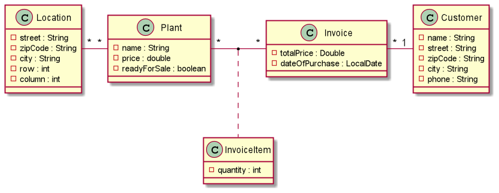
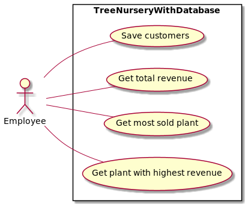
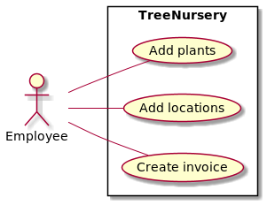

# birklbauer-baumschule project

## JAVA_HOME

Needs to be java-11 otherwise Panache will throw an exception

## Description:

With this project you can simulate the purchase process of a customer buying certain plants from a tree nursery and
manage the plants and locations of a tree nursery

# Class diagram


# Use-Case diagram for database


# Use-Case diagram


## [Swagger-Page](http://localhost:8080/swagger-ui)

## Checkliste - Erledigte Aufgaben

- [X] Tabellen entsprechen der 3. NF
- [X] Queries geben Daten aus mehreren Tabellen zurück
- [X] QueryParams und PathParams wurden angewendet
- [X] Alle 5 Request-Arten würden implementiert
- [X] Es wurden http-request Files angelegt
- [X] README beinhaltet Dokumentation, Datenmodell, Use-Case-Diagrams und Swagger-Link

## Running the application in dev mode

You can run your application in dev mode that enables live coding using:
```shell script
./mvnw compile quarkus:dev
```

## Packaging and running the application

The application can be packaged using:
```shell script
./mvnw package
```
It produces the `birklbauer-baumschule-1.0.0-SNAPSHOT-runner.jar` file in the `/target` directory.
Be aware that it?s not an _?ber-jar_ as the dependencies are copied into the `target/lib` directory.
If you want to build an _?ber-jar_, just add the `--uber-jar` option to the command line:
```shell script
./mvnw package -PuberJar
```

The application is now runnable using `java -jar target/birklbauer-baumschule-1.0.0-SNAPSHOT-runner.jar`.

## Creating a native executable

You can create a native executable using:
```shell script
./mvnw package -Pnative
```

Or, if you don't have GraalVM installed, you can run the native executable build in a container using:
```shell script
./mvnw package -Pnative -quarkus.native.container-build=true
```

You can then execute your native executable with: `./target/birklbauer-baumschule-1.0.0-SNAPSHOT-runner`

If you want to learn more about building native executables, please consult https://quarkus.io/guides/maven-tooling.html.

# RESTEasy JAX-RS

Guide: https://quarkus.io/guides/rest-json


